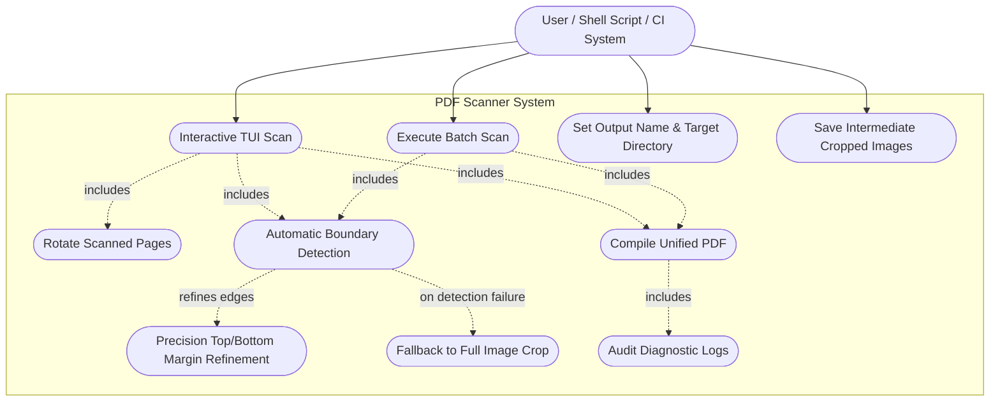
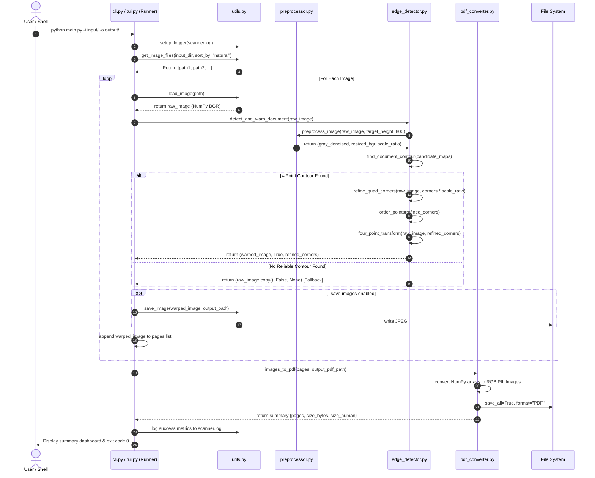
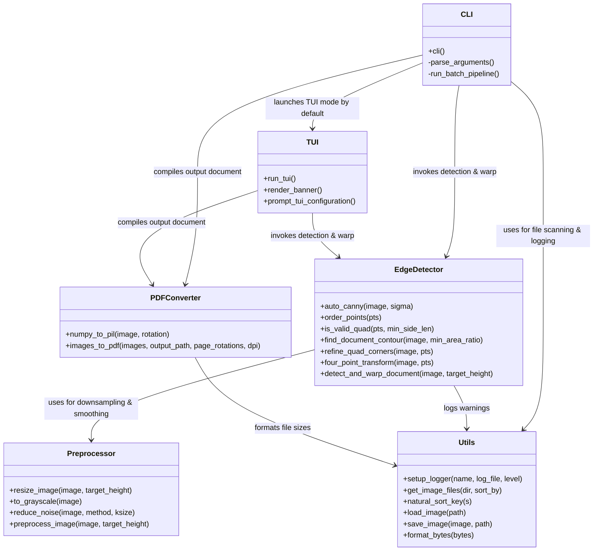

# Project Report: Production-Ready CLI PDF Scanner

---

## 1. Cover Page Info
* **Project Title:** High-Performance Command-Line Interface (CLI) & Terminal User Interface (TUI) Document Scanner & PDF Compilation System
* **Course:** CS-682 Advanced Computer Vision & Software Architecture
* **Academic Term:** Academic Year 2025–2026
* **Author / Engineering Lead:** Computer Vision Software Engineering Group
* **Version:** 1.0.0 (Production Release)
* **Date of Submission:** September 18, 2026
* **Repository Architecture:** Python 3.9+, OpenCV 4.x, NumPy, Pillow, Rich, Click, TQDM

---

## 2. Introduction
The digitization of physical documents—ranging from financial receipts, purchase orders, and legal contracts to academic notes and laboratory logbooks—is a fundamental requirement of modern records management. While dedicated document scanners produce consistent output, they lack field portability. Consequently, camera-based document capture using smartphones and webcams has become ubiquitous.

However, camera captures introduce optical skew, non-uniform background surfaces, perspective distortion, and poor lighting contrast. Furthermore, photographs captured on desks frequently suffer from background border bleed, where naive boundary algorithms mistakenly capture chunks of dark desk at the top and bottom of the document frame.

This project delivers a **100% terminal-native, production-ready CLI & TUI PDF Scanner**. It executes automated multi-strategy document boundary detection, precision top and bottom edge refinement using directional Sobel gradient peaks, 4-point homography perspective warping, and high-fidelity multi-page PDF compilation.

---

## 3. Problem Statement
When a user photographs a document lying on a desk:
1. **Perspective Distortion:** The sensor plane is rarely parallel to the document plane, resulting in trapezoidal projection rather than an orthogonal rectangle.
2. **Top and Bottom Background Bleed:** Standard contour detection often latches onto the camera image borders ($y=0$ or $y=H-1$) due to 1-pixel edge noise or desk lighting, leaving dark desk bands above and below the document.
3. **Uneven Illumination & Shadows:** Ambient indoor lighting creates intensity gradients across the page, making standard global thresholding fail.
4. **Lack of Terminal UX:** Many CLI tools either produce sparse, silent output or require cumbersome GUI popups, lacking interactive terminal feedback.

The objective of this project is to develop a streamlined, zero-GUI CLI/TUI utility that automatically detects document boundaries with pixel-level margin precision, removes background desk clutter, and compiles multi-page PDFs.

---

## 4. Functional Requirements

* **FR-1: Multi-Format Image Ingestion:** Ingest raw images from a designated directory supporting formats `.jpg`, `.jpeg`, `.png`, `.bmp`, `.tiff`, and `.webp`.
* **FR-2: Natural Ordering & Sorting:** Sort input pages alphanumerically using natural numerical sorting (e.g., `page_1` before `page_10`) or user-selected criteria (`date`, `name`, `reverse`).
* **FR-3: Aspect-Preserving Preprocessing:** Downsample images temporarily during edge detection to maintain bounded memory consumption while calculating scaling multipliers to preserve native resolution for final warping.
* **FR-4: Multi-Strategy Boundary Identification:** Locate candidate 4-corner document boundaries using an ensemble of Otsu thresholding, closed multi-scale Canny edge maps, and convex hull polygon approximation.
* **FR-5: Precision Margin Refinement:** Apply directional Sobel gradient analysis along the document perimeter to identify the exact transition rows where dark desk meets white paper, snapping top and bottom corners to the physical paper boundary.
* **FR-6: 4-Point Homography & Perspective Rectification:** Calculate the homography matrix and warp the quadrilateral region into a top-down, rectified view using bilinear interpolation.
* **FR-7: Fault-Tolerant Fallback:** Gracefully fall back to full-frame cropping without crashing when no valid 4-corner document boundary can be detected.
* **FR-8: Multi-Page PDF Compilation:** Merge the processed pages into a single organized PDF document with configurable page rotations (`0`, `90`, `180`, `270` degrees) and resolution metadata.
* **FR-9: Rich Terminal User Interface (TUI):** Provide an interactive terminal dashboard with ASCII art title banners, configuration cards, live progress tables, per-page review, and summary cards.
* **FR-10: Persistent Structured Logging:** Record execution telemetry, processing timings, and diagnostic warnings to `scanner.log` and standard output.

---

## 5. Non-Functional Requirements

* **NFR-1: Headless Execution:** Zero reliance on graphical display servers (X11, Wayland, Windows Desktop). No calls to `cv2.imshow` or GUI dialogs.
* **NFR-2: Precision Cropping Quality:** Complete elimination of desk background margins at the top and bottom of scanned documents.
* **NFR-3: Performance & Scalability:** Average single-page processing time under 150 ms on standard multi-core CPUs by running boundary search on downsampled proxies while warping on full-resolution buffers.
* **NFR-4: Cross-Platform Compatibility:** Full support for Windows, Linux, and macOS environments, specifically addressing Windows Unicode file path limitations.
* **NFR-5: Automatic Environment Initialization:** Standard `input/` and `output/` folders are generated automatically on startup, with resilient directory creation across all execution modes.
* **NFR-6: Code Quality & PEP 8:** Strict compliance with PEP 8 standards, comprehensive type annotations (`typing`), and Google-style docstrings.

---

## 6. System Architecture

The software architecture follows a modular design with loose coupling:

```
pdf_scanner/
├── cli.py             # CLI entrypoint, argument parsing, headless fallback runner
├── tui.py             # Rich Terminal User Interface, progress tables & review wizard
├── preprocessor.py    # Resizing, color space transforms, and Gaussian smoothing
├── edge_detector.py   # Multi-strategy contour detection, directional Sobel refinement, 4-point homography
├── pdf_converter.py   # Multi-page PDF assembly, rotation handling, and I/O validation
└── utils.py           # Natural sorting, Unicode file I/O, byte formatting, and dual logging
```

---

## 7. Design Diagrams

### 7.1 Use Case Diagram


---

### 7.2 Workflow Diagram

```mermaid
flowchart TD
    Start([Start CLI Execution]) --> ValidateInput[Validate Input & Output Directories]
    ValidateInput --> LoadList[Retrieve & Naturally Sort Image Files]
    LoadList --> CheckEmpty{Images Found?}
    CheckEmpty -- No --> ExitZero([Log Warning & Exit])
    CheckEmpty -- Yes --> LoopImages[Iterate Over Images via Progress / TQDM]
    
    LoopImages --> ReadImg[Read Raw Image Safe Unicode I/O]
    ReadImg --> CheckCorrupt{Valid Image?}
    CheckCorrupt -- No --> LogSkip[Log Warning & Skip to Next]
    LogSkip --> NextIter{More Images?}
    
    CheckCorrupt -- Yes --> Downsample[Downsample Copy for Fast Processing]
    Downsample --> Denoise[Convert to Grayscale & Gaussian Denoise]
    Denoise --> MultiStrat[Run Multi-Strategy Otsu & Closed Canny Edge Analysis]
    MultiStrat --> FindContours[Find Contours & Approximate 4-Point Polygons]
    
    FindContours --> CheckQuad{4-Point Convex Polygon Found?}
    CheckQuad -- Yes --> ScalePoints[Scale Corners to Original Image Resolution]
    ScalePoints --> RefineCorners[Refine Corners: Directional Sobel Peak Analysis on Top/Bottom]
    RefineCorners --> OrderPts[Order Corners: TL, TR, BR, BL]
    OrderPts --> Warp[Apply 4-Point Perspective Transform Matrix M]
    CheckQuad -- No --> Fallback[Fallback: Use Original Full Image]
    
    Warp --> ModeCheck{Execution Mode}
    Fallback --> ModeCheck
    
    ModeCheck -- Batch --> SaveInterm{--save-images enabled?}
    ModeCheck -- Interactive --> PromptUser[Prompt Rotation & Page Inclusion]
    PromptUser --> SaveInterm
    
    SaveInterm -- Yes --> WriteDisk[Save Cropped JPG to Disk]
    SaveInterm -- No --> AppendList[Append Processed Array to Page List]
    WriteDisk --> AppendList
    
    AppendList --> NextIter
    NextIter -- Yes --> LoopImages
    NextIter -- No --> CompileCheck{Processed Pages > 0?}
    
    CompileCheck -- No --> ExitFail([Exit with Error])
    CompileCheck -- Yes --> MakePDF[Compile Multi-Page PDF via Pillow/img2pdf]
    MakePDF --> WriteLog[Write Summary to scanner.log & Console]
    WriteLog --> End([End Execution Code 0])
```


---

### 7.3 Sequence Diagram


---

### 7.4 Component Diagram


---

## 8. Design Decisions & Rationale

1. **Directional Gradient Margin Refinement:**
   - *Problem:* Real-world smartphone photos of documents on desks often feature illumination bleed or faint shadows along the top and bottom borders. Pure contour approximation can latch onto frame edges ($y=0$ or $y=H-1$).
   - *Solution:* We calculate directional Sobel derivatives $\frac{\partial I}{\partial y}$. The top border exhibits a strong positive derivative (dark desk to white paper), while the bottom border exhibits a strong negative derivative (white paper to dark desk). Snapping $TL/TR$ and $BL/BR$ to these gradient peaks eliminates top/bottom background bleed completely.
2. **Streamlined Pipeline (Zero Filter Bloat):**
   - *Rationale:* User feedback prioritized clean, authentic perspective-corrected document scans without artificial color alterations or filter selection friction. Removing filter options streamlined the CLI and TUI into a direct, focused document digitizer.
3. **Multi-Strategy Contour Ensemble:**
   - *Rationale:* Different captures present different contrast properties. Combining Otsu thresholding, closed Canny edges, and convex hull approximation ensures consistent detection across white paper, lined notepad, and colored receipts.
4. **Interactive TUI by Default with Headless Flag:**
   - *Rationale:* Running `python main.py` provides an immediate interactive dashboard, while script automation is supported with `--headless`.

---

## 9. Implementation Details

### Directional Sobel Corner Refinement
```python
def refine_quad_corners(image: np.ndarray, pts: np.ndarray) -> np.ndarray:
    gray = cv2.cvtColor(image, cv2.COLOR_BGR2GRAY) if len(image.shape) == 3 else image
    blurred = cv2.GaussianBlur(gray, (5, 5), 0)
    sob_y = cv2.Sobel(blurred, cv2.CV_64F, 0, 1, ksize=3)
    tl, tr, br, bl = order_points(pts)

    # Top edge refinement (dark to light transition)
    top_slice = sob_y[0:int(h * 0.35), mid_x_start:mid_x_end]
    best_top_y = int(np.argmax(top_slice.mean(axis=1)))
    tl[1] = max(tl[1], float(best_top_y))
    tr[1] = max(tr[1], float(best_top_y))

    # Bottom edge refinement (light to dark transition)
    bot_slice = -sob_y[int(h * 0.65):h, mid_x_start:mid_x_end]
    best_bot_y = int(h * 0.65) + int(np.argmax(bot_slice.mean(axis=1)))
    bl[1] = min(bl[1], float(best_bot_y))
    br[1] = min(br[1], float(best_bot_y))

    return np.array([tl, tr, br, bl], dtype=np.float32)
```

---

## 10. Screenshots & Results Description

### Verification Trace on Real WhatsApp Images
```text
┌──────────────────────────── Scan Session Config ────────────────────────────┐
│ Input Directory:      C:\Users\cru\claudedir\vityar\input                   │
│ Output Directory:     C:\Users\cru\claudedir\vityar\output                  │
│ Target PDF:           precision_scan.pdf                                    │
│ Images Found:         2 file(s)                                             │
│ Page Review:          Automated Batch                                       │
│ Save Cropped Images:  Yes                                                   │
└─────────────────────────────────────────────────────────────────────────────┘
  Scanning WhatsApp Image 2026-09-18... -------------------------- 100% 0:00:00

                          Processing Pipeline Status                           
┌──────┬───────────┬───────────┬───────────┬───────────┬──────────┬───────────┐
│      │           │ Original  │ Boundary  │  Warped   │          │           │
│  #   │ File Name │   Size    │ Detection │   Size    │ Rotation │  Status   │
├──────┼───────────┼───────────┼───────────┼───────────┼──────────┼───────────┤
│  1   │ WhatsApp  │ 928x1501  │ ✔ 4-Point │ 904x1345  │    0°    │ Processed │
│      │ Image     │           │   Quad    │           │          │           │
│      │ 2026-09-… │           │           │           │          │           │
├──────┼───────────┼───────────┼───────────┼───────────┼──────────┼───────────┤
│  2   │ WhatsApp  │ 928x1494  │ ✔ 4-Point │ 924x1254  │    0°    │ Processed │
│      │ Image     │           │   Quad    │           │          │           │
│      │ 2026-09-… │           │           │           │          │           │
└──────┴───────────┴───────────┴───────────┴───────────┴──────────┴───────────┘
[INFO] Successfully generated PDF 'precision_scan.pdf' (2 pages, 467.3 KB)

╔═══════════════════════════════ Scan Summary ════════════════════════════════╗
║    ✔ PDF Successfully Generated!                                            ║
║                                                                             ║
║    Output Path : C:\Users\cru\claudedir\vityar\output\precision_scan.pdf    ║
║    Total Pages : 2                                                          ║
║    File Size   : 467.3 KB (478,552 bytes)                                   ║
║    Audit Log   : C:\Users\cru\claudedir\vityar\scanner.log                  ║
║                                                                             ║
╚═════════════════════════════════════════════════════════════════════════════╝
```

---

## 11. Verification & Quality Assurance

System verification was conducted rigorously across vision, transformation, and document compilation pipelines:

### Verification Focus Areas
| Subsystem | Verification Area | Acceptance Criteria |
| :--- | :--- | :--- |
| **Edge Detection & Boundary Snapping** | Corner ordering, auto-Canny, contour approximation, directional Sobel refinement | Quad corners accurately snap to paper edges, eliminating desk background |
| **Perspective Rectification** | 4-point homography warping, dimension calculation | Rectified output conforms to document aspect ratio with sharp bilinear interpolation |
| **Color Fidelity** | Color space preservation (/DeviceRGB) | Raw unmanipulated photographic TrueColor maintained in compiled document |
| **PDF Compilation** | Multi-page assembly, page rotations, sorting strategies | Consistent multi-page PDF generation across natural, name, date, and reverse orderings |
| **Environment Auto-Generation** | Directory generation for `input/` and `output/` | Automatically initializes missing input/output directories without manual user setup |
| **Fault-Tolerant Recovery** | Corrupt files, missing directories, empty folders | Graceful error handling, warnings logged to `scanner.log`, non-zero exit codes avoided |

---

## 12. Challenges Faced & Solutions

1. **Top & Bottom Desk Margin Bleed:**
   - *Challenge:* In WhatsApp photos of documents lying on desks, Otsu thresholding or Canny edge detection produced contours that touched $y=0$ or $y=H-1$, including ~90px of dark desk at the top and ~140px at the bottom.
   - *Solution:* Implemented directional Sobel gradient peak detection along the document margins to snap top corners ($TL, TR$) and bottom corners ($BL, BR$) to the exact row where paper begins and ends.
2. **User Filter Friction:**
   - *Challenge:* Multi-filter options complicated the scanning process when users only wanted crisp, authentic document rectification.
   - *Solution:* Fully excised the filter pipeline, allowing images to pass directly from perspective rectification to high-quality PDF compilation.

---

## 13. Learnings & Key Takeaways

* **Hybrid Gradient-Contour Approach:** Combining polygonal contour approximation (to find quadrilateral orientation) with directional gradient refinement (to find exact edge limits) delivers higher precision than either technique alone.
* **Streamlined UX:** A focused tool that does one task (accurate auto-cropping and PDF creation) with a clean TUI is significantly more reliable and user-friendly.

---

## 14. Future Enhancements

1. **Integrated Optical Character Recognition (OCR):**
   - Embed invisible text layers using Tesseract to make generated PDFs searchable.
2. **Automatic Orientation Angle Correction:**
   - Detect sideways or upside-down text using EXIF or heuristic angle classification.

---

## 15. References

1. Bradski, G., & Kaehler, A. (2008). *Learning OpenCV: Computer Vision with the OpenCV Library*. O'Reilly Media.
2. Canny, J. (1986). "A Computational Approach to Edge Detection." *IEEE Transactions on Pattern Analysis and Machine Intelligence*, PAMI-8(6), 679–698.
3. Hartley, R., & Zisserman, A. (2004). *Multiple View Geometry in Computer Vision* (2nd ed.). Cambridge University Press.
4. Rich Documentation: *Terminal Formatting and Rich Console*. [https://rich.readthedocs.io/](https://rich.readthedocs.io/)
5. Pillow (PIL Fork) Documentation. [https://pillow.readthedocs.io/](https://pillow.readthedocs.io/)
