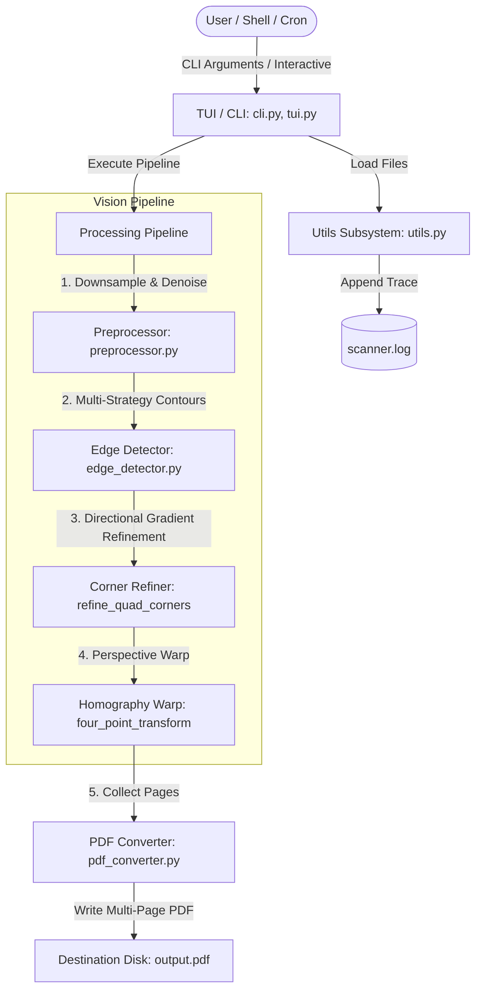

# System Architecture & Design Diagrams: CLI PDF Scanner

This document outlines the architectural blueprint, data flow, component interactions, and execution pipelines of the CLI PDF Scanner application.

---

## 1. System Architecture Overview

The system is structured as a decoupled, layered pipeline:
1. **CLI, TUI & Orchestration Layer (`cli.py`, `tui.py`, `main.py`):** Parses user commands, renders Rich terminal user interface displays, manages progress bars, and coordinates scanning sessions.
2. **Preprocessing Layer (`preprocessor.py`):** Performs aspect-ratio downsampling, colorspace conversions, and morphological noise reduction.
3. **Computer Vision & Precision Rectification Layer (`edge_detector.py`):** Multi-strategy contour detection, directional Sobel gradient corner refinement for precision top/bottom cropping, and 4-point homography perspective warping.
4. **Compilation & I/O Subsystem (`pdf_converter.py`, `utils.py`):** Enforces natural sorting, compiles multi-page PDFs, and maintains structured audit logs.

---

## 2. Mermaid Design Diagrams Index

The complete set of design diagrams includes:
1. **[Use Case Diagram](diagrams/use_case.md):** Illustrates user interactions, TUI wizard, page review, and error recovery.
2. **[Workflow Diagram](diagrams/workflow.md):** End-to-end data processing flowchart showing detection, refinement, warping, and fallback branches.
3. **[Sequence Diagram](diagrams/sequence.md):** Step-by-step object interactions during batch scanning and PDF compilation.
4. **[Component Diagram](diagrams/component.md):** High-level component decomposition and dependency couplings.
