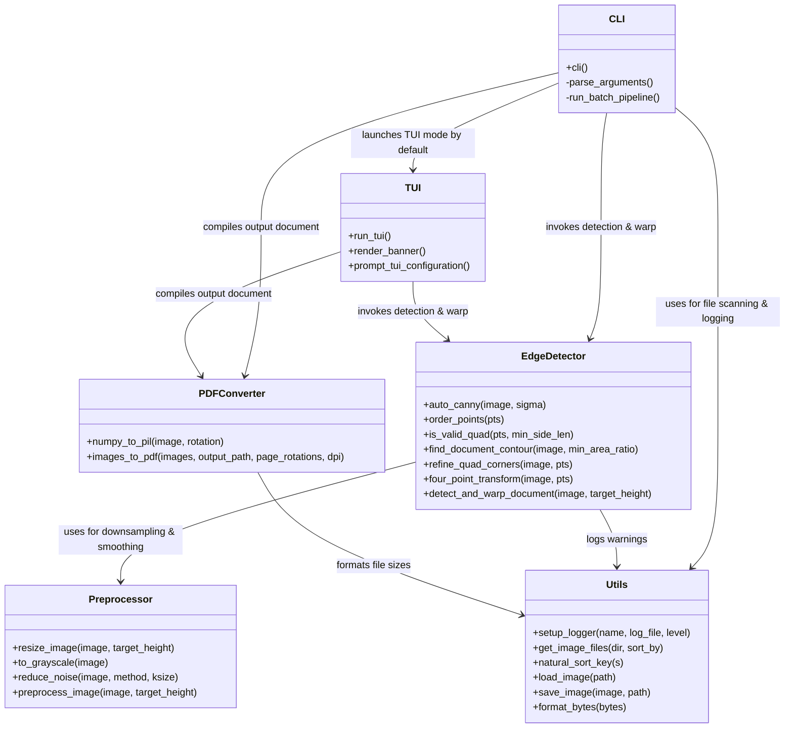

# Component Diagram

```mermaid
classDiagram
    class CLI {
        +cli()
        -parse_arguments()
        -run_batch_pipeline()
    }

    class TUI {
        +run_tui()
        +render_banner()
        +prompt_tui_configuration()
    }

    class Utils {
        +setup_logger(name, log_file, level)
        +get_image_files(dir, sort_by)
        +natural_sort_key(s)
        +load_image(path)
        +save_image(image, path)
        +format_bytes(bytes)
    }

    class Preprocessor {
        +resize_image(image, target_height)
        +to_grayscale(image)
        +reduce_noise(image, method, ksize)
        +preprocess_image(image, target_height)
    }

    class EdgeDetector {
        +auto_canny(image, sigma)
        +order_points(pts)
        +is_valid_quad(pts, min_side_len)
        +find_document_contour(image, min_area_ratio)
        +refine_quad_corners(image, pts)
        +four_point_transform(image, pts)
        +detect_and_warp_document(image, target_height)
    }

    class PDFConverter {
        +numpy_to_pil(image, rotation)
        +images_to_pdf(images, output_path, page_rotations, dpi)
    }

    CLI --> TUI : launches TUI mode by default
    CLI --> Utils : uses for file scanning & logging
    CLI --> EdgeDetector : invokes detection & warp
    CLI --> PDFConverter : compiles output document
    TUI --> EdgeDetector : invokes detection & warp
    TUI --> PDFConverter : compiles output document
    EdgeDetector --> Preprocessor : uses for downsampling & smoothing
    EdgeDetector --> Utils : logs warnings
    PDFConverter --> Utils : formats file sizes
```
