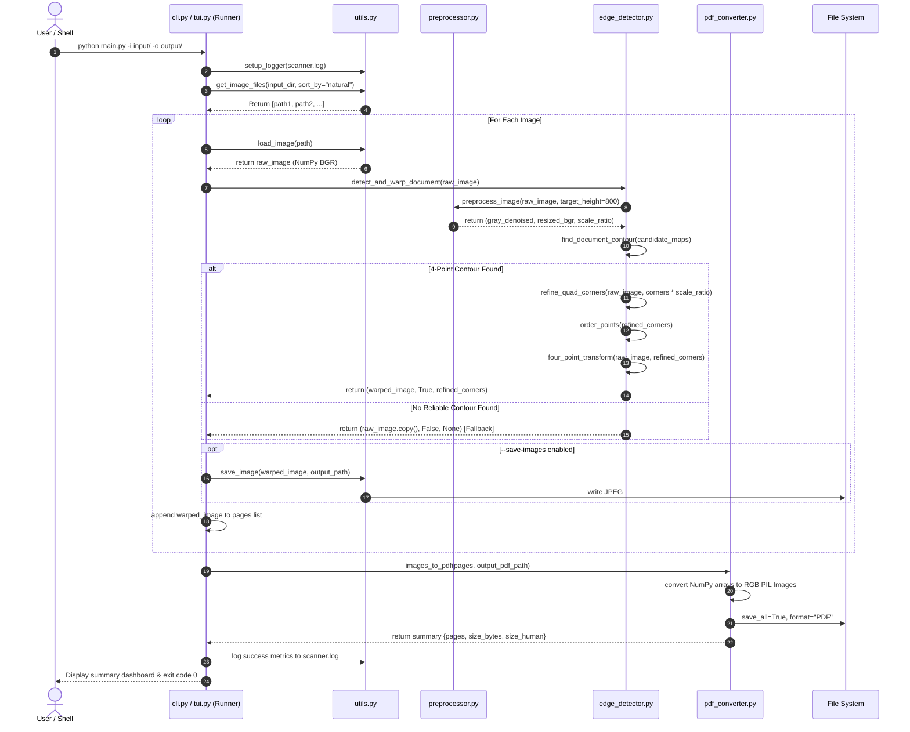

# Sequence Diagram

```mermaid
sequenceDiagram
    autonumber
    actor User as User / Shell
    participant CLI as cli.py / tui.py (Runner)
    participant Utils as utils.py
    participant Pre as preprocessor.py
    participant Edge as edge_detector.py
    participant PDF as pdf_converter.py
    participant Disk as File System

    User->>CLI: python main.py -i input/ -o output/
    CLI->>Utils: setup_logger(scanner.log)
    CLI->>Utils: get_image_files(input_dir, sort_by="natural")
    Utils-->>CLI: Return [path1, path2, ...]
    
    loop For Each Image
        CLI->>Utils: load_image(path)
        Utils-->>CLI: return raw_image (NumPy BGR)
        
        CLI->>Edge: detect_and_warp_document(raw_image)
        Edge->>Pre: preprocess_image(raw_image, target_height=800)
        Pre-->>Edge: return (gray_denoised, resized_bgr, scale_ratio)
        
        Edge->>Edge: find_document_contour(candidate_maps)
        alt 4-Point Contour Found
            Edge->>Edge: refine_quad_corners(raw_image, corners * scale_ratio)
            Edge->>Edge: order_points(refined_corners)
            Edge->>Edge: four_point_transform(raw_image, refined_corners)
            Edge-->>CLI: return (warped_image, True, refined_corners)
        else No Reliable Contour Found
            Edge-->>CLI: return (raw_image.copy(), False, None) [Fallback]
        end
        
        opt --save-images enabled
            CLI->>Utils: save_image(warped_image, output_path)
            Utils->>Disk: write JPEG
        end
        CLI->>CLI: append warped_image to pages list
    end
    
    CLI->>PDF: images_to_pdf(pages, output_pdf_path)
    PDF->>PDF: convert NumPy arrays to RGB PIL Images
    PDF->>Disk: save_all=True, format="PDF"
    PDF-->>CLI: return summary {pages, size_bytes, size_human}
    
    CLI->>Utils: log success metrics to scanner.log
    CLI-->>User: Display summary dashboard & exit code 0
```
