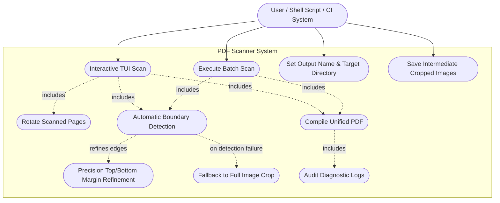

# Use Case Diagram

```mermaid
flowchart TD
    actorUser([User / Shell Script / CI System])

    subgraph PDF Scanner System
        UC1([Execute Batch Scan])
        UC2([Interactive TUI Scan])
        UC3([Rotate Scanned Pages])
        UC4([Set Output Name & Target Directory])
        UC5([Save Intermediate Cropped Images])
        UC6([Automatic Boundary Detection])
        UC7([Precision Top/Bottom Margin Refinement])
        UC8([Fallback to Full Image Crop])
        UC9([Compile Unified PDF])
        UC10([Audit Diagnostic Logs])
    end

    actorUser --> UC1
    actorUser --> UC2
    actorUser --> UC4
    actorUser --> UC5

    UC1 -.->|includes| UC6
    UC2 -.->|includes| UC6
    UC6 -.->|refines edges| UC7
    UC2 -.->|includes| UC3
    UC6 -.->|on detection failure| UC8
    UC1 -.->|includes| UC9
    UC2 -.->|includes| UC9
    UC9 -.->|includes| UC10
```
