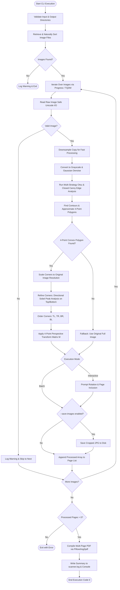

# Processing Workflow Diagram

```mermaid
flowchart TD
    Start([Start CLI Execution]) --> ValidateInput[Validate Input & Output Directories]
    ValidateInput --> LoadList[Retrieve & Naturally Sort Image Files]
    LoadList --> CheckEmpty{Images Found?}
    CheckEmpty -- No --> ExitZero([Log Warning & Exit])
    CheckEmpty -- Yes --> LoopImages[Iterate Over Images via Progress / TQDM]
    
    LoopImages --> ReadImg[Read Raw Image Safe Unicode I/O]
    ReadImg --> CheckCorrupt{Valid Image?}
    CheckCorrupt -- No --> LogSkip[Log Warning & Skip to Next]
    LogSkip --> NextIter{More Images?}
    
    CheckCorrupt -- Yes --> Downsample[Downsample Copy for Fast Processing]
    Downsample --> Denoise[Convert to Grayscale & Gaussian Denoise]
    Denoise --> MultiStrat[Run Multi-Strategy Otsu & Closed Canny Edge Analysis]
    MultiStrat --> FindContours[Find Contours & Approximate 4-Point Polygons]
    
    FindContours --> CheckQuad{4-Point Convex Polygon Found?}
    CheckQuad -- Yes --> ScalePoints[Scale Corners to Original Image Resolution]
    ScalePoints --> RefineCorners[Refine Corners: Directional Sobel Peak Analysis on Top/Bottom]
    RefineCorners --> OrderPts[Order Corners: TL, TR, BR, BL]
    OrderPts --> Warp[Apply 4-Point Perspective Transform Matrix M]
    CheckQuad -- No --> Fallback[Fallback: Use Original Full Image]
    
    Warp --> ModeCheck{Execution Mode}
    Fallback --> ModeCheck
    
    ModeCheck -- Batch --> SaveInterm{--save-images enabled?}
    ModeCheck -- Interactive --> PromptUser[Prompt Rotation & Page Inclusion]
    PromptUser --> SaveInterm
    
    SaveInterm -- Yes --> WriteDisk[Save Cropped JPG to Disk]
    SaveInterm -- No --> AppendList[Append Processed Array to Page List]
    WriteDisk --> AppendList
    
    AppendList --> NextIter
    NextIter -- Yes --> LoopImages
    NextIter -- No --> CompileCheck{Processed Pages > 0?}
    
    CompileCheck -- No --> ExitFail([Exit with Error])
    CompileCheck -- Yes --> MakePDF[Compile Multi-Page PDF via Pillow/img2pdf]
    MakePDF --> WriteLog[Write Summary to scanner.log & Console]
    WriteLog --> End([End Execution Code 0])
```
